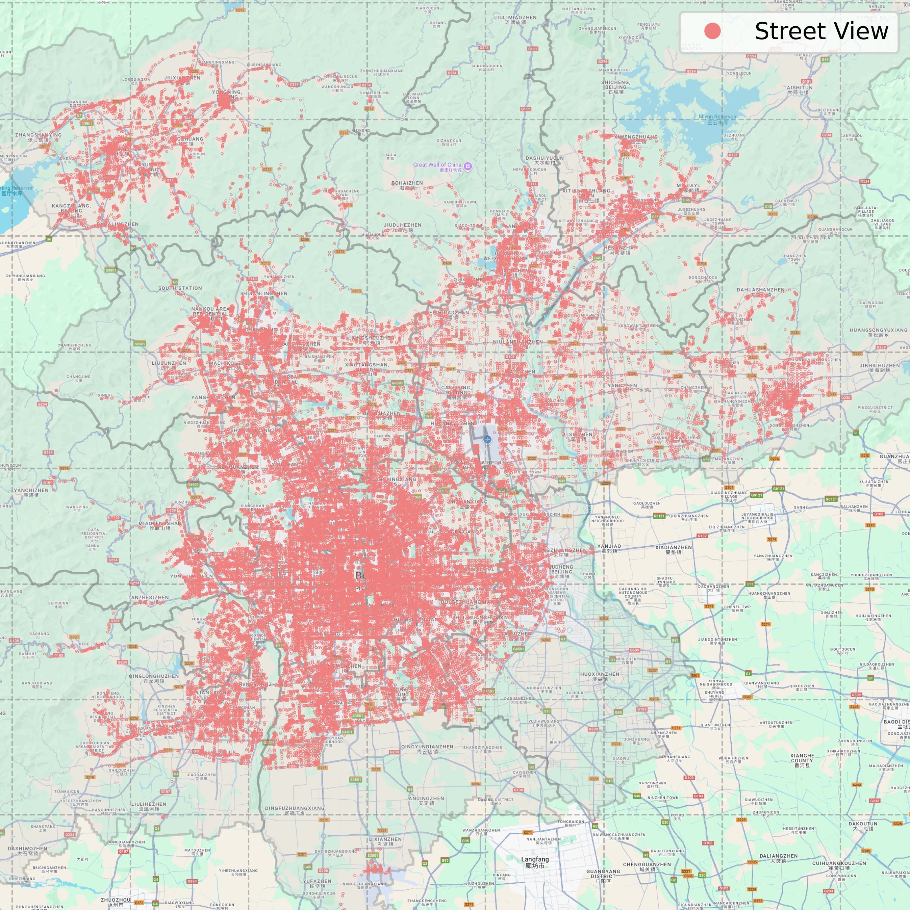
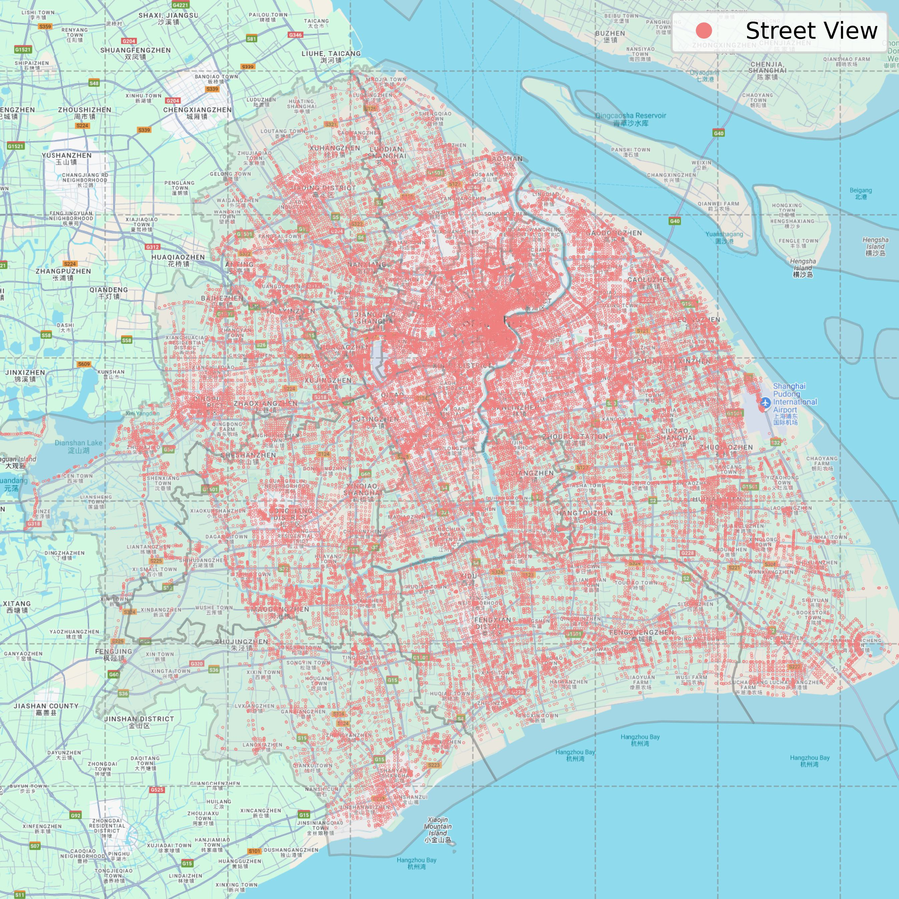

# Text-Vision-Geography: Cross-modal Spatial Semantic Understanding and Retrieval (SIGIR 2026 Under Review)
The development of the World Wide Web has reshaped the interaction between humans and the real world. While Location-Based Services (LBS) excel at retrieving Points of Interest (POIs) by keywords, they struggle to understand human-centered, experiential queries like "quiet streets suitable for walking" or "steakhouses with convenient parking." This limitation highlights a critical gap between functional search and real-world understanding. To address this issue, we propose a novel and challenging task: cross-modal spatial semantic retrieval. The core challenge lies in bridging the significant semantic gap between users' descriptive intentions, complex visual elements in the real world, and geographic information. First, we construct and release a large-scale benchmark dataset StreetSem, which comprises over 460,000 street view images with corresponding text and geographic information. Second, we propose a model called CSSR that integrates semantic, geographic, and field-of-view constraints to align multimodal features from user intent, street view images, and spatial information. Finally, extensive experiments demonstrate that our model significantly outperforms keyword-based and cross-modal retrieval baselines. This work extends beyond traditional keyword and text-image retrieval by enabling spatial semantic understanding and offering new perspectives for next-generation human-centered LBS.

## Requirements
* python == 3.10
* numpy == 1.26.4
* pandas == 2.3.1
* pytorch == 2.7.1
* scikit-learn == 1.7.1
* tqdm == 4.67.1
* st-moe-pytorch == 0.1.8
* transformers == 4.56.2
* python-geohash == 0.8.5
* haversine == 2.9.0
* lmdb == 1.7.3
* faiss-gpu-cu12 == 1.11.0

## Running the Code

To run the code, follow these steps:

1. Clone the repository:
    ```bash
    git clone https://anonymous.4open.science/r/CSSR-2D45
    cd ./CSSR-2D45
    ```

2. Install the required dependencies:
    ```bash
    pip install -r requirements.txt
    ```

3. Download lmdb database and metadata.
    ```bash
    wget https://download_link/StreetSem.zip ./save/dataset/StreetSem/
    unzip ./save/dataset/StreetSem/StreetSem.zip -d ./save/dataset/StreetSem/
    ```

4. Train and validate the model:
    ```bash
    python start.py
    ```


## StreetSem Dataset
**Since the dataset is very large, it cannot be uploaded to an anonymous GitHub repository. To comply with the anonymity policy of the WWW conference, we will release the full dataset download link after the paper is accepted.**

This study constructs and releases a large-scale benchmark dataset StreetSem, which contains data from two major Chinese cities: Beijing and Shanghai. The dataset consists of three parts: 1) Street View Images: We obtained 360-degree panoramic street view images of these two cities from publicly available LBS, and segmented them based on different horizontal field-of-view angles, where ${fov} \in \{0^\circ, 90^\circ, 180^\circ, 270^\circ\}$. 2) Image Summaries: We used the Qwen2.5-VL vision-language model (VLM) to generate textual summaries of visual elements in street view images. Additionally, to enrich geographic context, we supplemented the summaries with the names of nearby roads and POIs. 3) Queries: We used the Qwen3 large language model (LLM) to generate five types of queries for each street view image: atmosphere, activity, object, geography, and creativity. 

To protect privacy, faces and license plates in the dataset have been blurred. To ensure data quality, the data generated by VLM and LLM underwent a dual verification through length rules and manual review, thereby reducing the impact of model hallucination and ensuring that the text conforms to human expression. The dataset contains 262,904 street-view images from Beijing and 202,456 from Shanghai.

### Geographical Distribution 
<!-- 
 -->
<table align="center">
  <tr>
    <td></td>
    <td></td>
  </tr>
  <tr align="center">
    <td>(a) Beijing</td>
    <td>(b) Shanghai</td>
  </tr>
</table>

### Data Sample
|Field|Data|
|---|---|
|Street View Image||
|Field-of-view|180|
| Geographic Location   | (40.36474, 115.98144) |
| Text Summary          | &lt;Street Name&gt; &lt;POIs&gt; This street view picture shows a typical Chinese traditional architectural style. The buildings have typical red bricks and gray tiles ... |
| Atmosphere Query      | A quiet and peaceful rural street corner in traditional Chinese style ...                                                                          |
| Activity Query        | Find a quiet intersection suitable for parking, strolling, and experiencing ...                                                                    |
| Object Query          | Chinese-style old buildings with red brick and gray tile walls, red lanterns ...                                                                   |
| Geographical Query    | What does the intersection next to Bada Ling Suyan Xiaozhu Guesthouse ...                                                                          |
| Creative Query        | I want to find a quiet street corner with an old-time feel after the rain ...                                                                      |


